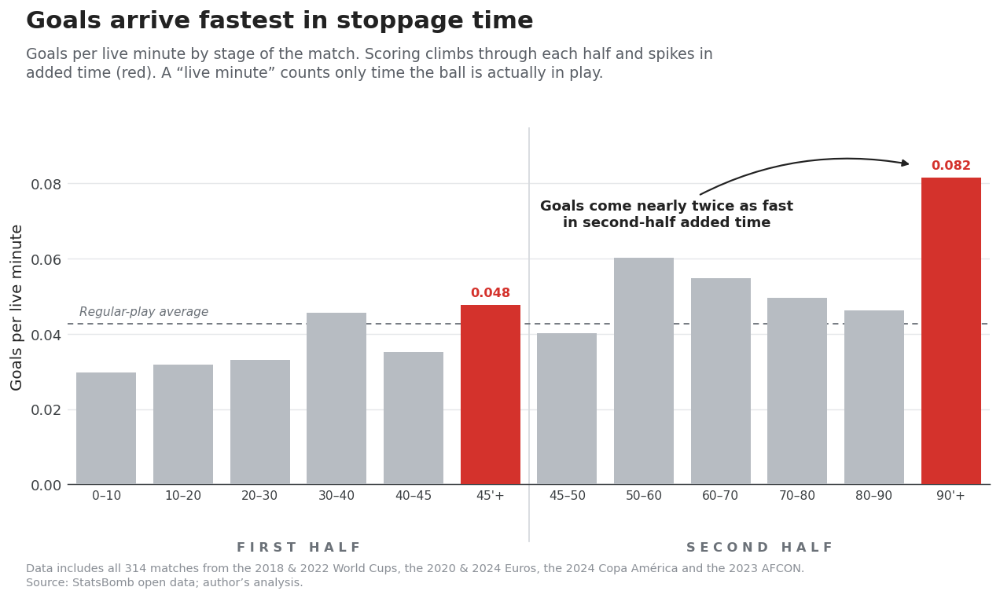

# The Stoppage Time That Never Gets Played

*A fully reproducible measurement across the last six major international tournaments (314 matches). Owed stoppage vs. stoppage actually played — and what the missing minutes would have changed.*

---

Stoppage time is a sham.

Over the last six major international tournaments, if stoppage time were awarded according to the laws of the game, I estimate that **23.6%** of matches would have finished with a different scoreline, and **12.1%** with a different result.

Those are the only two modeled numbers in this piece, and I keep them apart everywhere: a *scoreline* can change without the *result* changing. Both ship with a confidence interval and a full sensitivity table, never as bare point estimates — the scoreline figure is **23.6% [95% CI 20.6%, 27.4%]**, the result figure is **12.1% [95% CI 10.6%, 14.2%]**. "About 1 in 8" is that 12.1% (one match in 8.3, to be exact). Everything below traces to a script, a checked-in table, and a documented assumption. That is the standard of proof, and the entire pipeline is public.

## Why I dug into this

The motivation for this model comes from two insights about football matches:

**1. Stoppage time is systematically under-awarded.** During the 2018 World Cup, Nate Silver found that refs omit roughly half of true stoppage time. Building on Nate's work, I pulled the data for every match in the last 6 major international tournaments (World Cup '18 & '22, Euros '20 & '24, Copa '24, AFCON '23), and plotted the relationship between true versus played stoppage time.†


*My estimate of owed stoppage (vertical) against the stoppage actually played (horizontal), every match across all six tournaments. The cloud sits well above the line of equality: almost every match owes more added time than it gets.*

**2. Teams are much more productive during stoppage time.**



*Goals per live minute, by stage of the match. The stoppage-time bars (highlighted) tower over open play — second-half stoppage runs about 1.9× the open-play rate.*

In short, referees chronically under-award the crucial minutes that flip match outcomes.

*† Others have corroborated this finding, and measured biases that impact stoppage-time allocation. [VERIFY: add the specific external citations — e.g. the post-2022 league analyses of under-added time — before publishing; those figures sit outside my six-tournament dataset and I have not independently confirmed them.]*

## How the counterfactual actually works

The core idea is simple. Take all 314 matches exactly as they were played. For each one, *append* the stoppage time the referee should have added but didn't, and ask a single question: would at least one more goal plausibly have dropped in? Average that probability over all 314 matches, and you get the headline. The work is in making each step honest and checkable.

**Step 1 — Measure the live football, then validate it against outside numbers.** Every match comes from StatsBomb's hand-coded event data: an analyst watches the video and logs every touch — pass, shot, throw-in, foul, card, sub, ball out of play — timestamped to the second. When the ball is dead, nothing gets logged, so a gap opens in the timestamps. Those gaps give me *ball-in-play*. I validate against the best anchors available: for 2022, my reconstruction reads **57:40 against Opta's 58:04** (−24s); for 2018, **56:00 against Opta's 54:50** (+70s), with FiveThirtyEight's 55:18 sitting in between.

The calculation relies on one global threshold — how long a silent gap must run before the ball counts as "dead." Sweeping it from 12 to 30 seconds, the two anchors respond at different slopes, so I report ball-in-play with about ±1 minute per match of genuine uncertainty rather than a false-precision point. The reassuring part: the headline doesn't depend on getting this exactly right. Pushing the threshold across that entire 12s–30s range shifts the final answer by **less than 0.1 percentage points**. The live-football level is a denominator that very nearly cancels out.

**Step 2 — Separate stoppage *owed* from stoppage *played*, and validate that, too.** Stoppage actually played is the easy half: it's whistle-to-whistle added time, read straight off the event clock. Stoppage *owed* is the hard part. I estimate it from the dead time the data can identify — goal celebrations, substitutions, cards, injuries, and the excess of slow restarts over a normal allowance — plus the dead-ball gaps the data independently confirms.

What the rulebook actually requires is sweeping and unquantified. The Laws of the Game (Law 7) tell the referee to add on, at the end of each half, *all* the time lost to substitutions, injuries, celebrations, disciplinary action, VAR checks, and deliberate time-wasting. What the Laws never do is put a *number* on any of it — there is no stated allowance for how long a routine throw-in, goal kick, or free kick may take before the delay counts as time lost. So to measure owed stoppage at all, you have to supply the thresholds the rulebook omits. Nate Silver's 2018 stopwatch study supplied exactly that, and I adopt his table unchanged:

| Routine restart | Normal allowance (excess beyond this counts as owed) |
|---|---|
| Throw-in | 20 s |
| Goal kick | 30 s |
| Corner kick | 45 s |
| Free kick | 60 s |

A throw-in that takes 50 seconds contributes 30 seconds of owed stoppage; one that takes 15 contributes nothing. Genuine stoppages — celebrations, subs, cards, injuries — are credited in full and separately; this table only governs the grey area the Laws hand to the referee's discretion.

Then I calibrate the whole estimator against the one piece of independent ground truth that exists: **Nate Silver's by-hand measurement of all 32 World Cup 2018 matches**, where he recorded both the stoppage that *should* have been added and the stoppage that *was*.


*Validation against Nate Silver's independent, hand-measured World Cup 2018 data (32 matches). Left: my owed-stoppage estimate vs his "should-have-been-added" minutes — r = 0.825, average error 2.44 minutes. Right: my stoppage-played clock vs his "actually-played" minutes — r = 0.992, near-exact. The dashed line is perfect agreement.*

The near-exact right panel is what makes the gap in the left panel believable: Nate, with a stopwatch and no access to my pipeline, found the same shortfall I do. That gap is the engine of the whole piece. Across the 314 matches, owed stoppage averages about **17 minutes** and played stoppage about **9**, leaving roughly **8.6 omitted minutes per match** — positive in **97% of matches** — of which about **5.1 are live ball-in-play** once dead time is stripped out.

This shortfall is not a relic of the bad old days, either. The 2022 FIFA directive told referees to add time more fully, and the boards did jump — but they still fall short of what's owed.


*Stoppage time actually played, before vs. after the 2022 directive. Boards rose from about 7 minutes (PRE: WC 2018, Euro 2020) to 11–12 (POST, led by WC 2022) — a real change, but still below what the rulebook owes.*

**Step 3 — Price the missing minutes.** Each omitted live minute gets a goal rate. Expected extra goals is just rate times minutes; the chance of *at least one* extra goal follows from the Poisson formula:

```
For each match:
    μ  =  (1st-half goal rate)       × (omitted live 1st-half minutes)
        + (decayed 2nd-half rate)    × (omitted live 2nd-half minutes)

    P(at least one extra goal)  =  1 − e^(−μ)

    Headline  =  average of P(≥1) across all 314 matches
```

The one subtlety — and the most common objection — is the *rate*.

## The obvious objection — and why the number survives it

The first thing anyone with a quantitative bone says is: "you can't price new minutes at the frantic end-of-game rate — teams wouldn't keep scoring that fast." They're right, and the model is built around agreeing with them.

Start by conceding the premise, because it's true. Goals don't arrive evenly: scoring climbs through a match, and second-half stoppage is the most productive window on the field.

| Window | Goals per live-minute | Goals (n) |
|---|---|---|
| 2nd-half stoppage (the late-game peak) | **0.0816** | 73 |
| 1st-half stoppage | 0.0478 | 23 |
| Regulation open play (the floor) | **0.0427** | 675 |

That peak is **1.91× the open-play rate** — and the reason isn't anything about referees. It's how football is played late: a losing team throws everyone forward, defenses stretch, the game opens up. Which is the objection in disguise: that rate is *endogenous to game state*. The minutes I observe at 0.0816 are selected for desperation, so pricing fresh, neutral minutes at that rate would overstate the result. I handle this three ways.

**First, the rate decays.** I don't assume the late-game premium persists into the added minutes. Each marginal omitted second-half minute is priced on a curve that decays from the observed 0.0816 back toward the open-play floor of 0.0427, with a half-life I sweep from 2 to 8 minutes (central case: 4). The longer the hypothetical window, the closer each further minute is priced to ordinary open play. The first half keeps its observed rate, since the premium is concentrated in the second. Crucially, the floor *is* open play — so even under maximum decay, added minutes are never priced below match-average football. They're still football.


*Left: the per-minute rate assigned to an omitted second-half minute, decaying from the observed stoppage rate (0.0816) toward the open-play floor (0.0427), for half-lives of 2, 4 (central), and 8 minutes. Right: the average rate a match effectively receives as a function of its total omitted minutes. Because most matches have modest windows, the effective rate sits well above the floor — but well below the raw peak.*

How much does this assumption move the answer? The whole decay band runs from **22.2%** (fastest decay) to **24.9%** (slowest) — a swing of under three points around the 23.6% headline. The objection is real, it's priced in, and it moves the result by a couple of points, not by half.

**Second, the premium isn't just a tied-game artifact.** If the high rate were purely a product of desperate, level matches, it should collapse when the match isn't close. It doesn't. Second-half stoppage scores at about the same rate whether the game is level at 90 minutes (**0.0886**) or not (**0.0786**) — the confidence intervals overlap heavily. So conditioning the entire model on score state at 90 minutes barely moves anything: the headline shifts from 23.6% to **23.4%**, a fifth of a point.

**Third, it isn't a knockout artifact.** The other natural worry is stakes — maybe the late-game rate is inflated by win-or-go-home matches. It isn't. Split the same window by match type and the rate is statistically flat: **group stage 0.0847** (56 goals / 660.8 live-minutes) against **elimination 0.0727** (17 goals / 233.7 live-minutes), with the point estimate actually leaning *higher* in the group stage (rate ratio 1.17, binomial p = 0.69 — not significant). There's no separate elimination effect to price, so the model keeps a single pooled rate.

Put together: I grant that late minutes are unusually productive and that the productivity is partly a game-state effect — and after pricing both in, the answer barely moves.

## Results and sensitivity

Here is the whole thing on one page.

| Quantity | Value |
|---|---|
| **Headline — different scoreline (central)** | **23.6%** |
| 95% bootstrap confidence interval (sampling) | **[20.6%, 27.4%]** |
| Specification band — one modeling choice varied at a time | **21.1% – 26.1%** |
| Full envelope — all modeling choices varied jointly | **18.6% – 27.3%** |
| **Different *result*** — winner/draw actually changes | **12.1% [10.6%, 14.2%]** |
| Second-half-only variant (comparison, not the headline) | 16.0% [14.0%, 18.5%] |

There are two distinct kinds of uncertainty, and I keep them apart. *Sampling* uncertainty is the bootstrap CI **[20.6%, 27.4%]** (width 6.7 points): over 1,000 draws, each goal-rate cell is redrawn from a Jeffreys–Gamma posterior and a shared owed-stoppage estimator-error term is split across the two halves. *Specification* uncertainty is how the headline moves as defensible modeling choices change — one at a time (the 21.1–26.1% band) or all jointly (the 18.6–27.3% envelope).


*The counterfactual share with 95% confidence intervals as each modeling choice is varied. The central estimate is 23.6%; the spread across defensible choices is comparable to sampling noise, not larger.*

| Modeling choice | Levels → X% | Spread |
|---|---|---|
| **λ source** | all-pooled **23.6** · POST-only 22.6 · regime-matched 23.8 · PRE-only 26.1 | ~3.5 pts |
| **Gross-up** | off 21.1 → **on 23.6** → geometric 24.2 | ~3.1 pts |
| **Decay half-life** | h=2 22.2 · **h=4 23.6** · h=8 24.9 | ~2.7 pts |
| **Conditioning** | overall **23.6** · split by tied/not-tied 23.4 | ~0.2 pts |
| One-at-a-time band | **21.1% – 26.1%** | 5.0 pts ≈ 0.7× sampling |
| Full **joint** envelope | **18.6% – 27.3%** | 8.7 pts ≈ 1.3× sampling |

The one-at-a-time band (5.0 pts) is comparable to the sampling CI (6.7 pts), and the joint envelope (8.7 pts) only modestly exceeds it — neither kind of uncertainty dominates. The headline does not hinge on any single knob.

One number I won't dress up: scoreline (23.6%) is not result (12.1%). A scoreline can change without the winner changing, and **95 of the 314 matches** were already decided by two or more goals at 90 minutes, so they cannot flip at all. Conflating the two is the single most attackable sentence anyone could write about this work, so I state them apart, always.

**The honest limitation.** The owed-stoppage estimator is anchored on World Cup 2018 — the dead-gap crediting rule and the residual correction are calibrated there, then frozen and applied unchanged to the other five tournaments. That transfer crosses the 2022 directive: my one calibration tournament sits on the PRE side, while the headline mostly lives on the POST side, where referees were explicitly told to behave differently. And the extrapolation is large — estimated owed time in the five un-checked tournaments runs about **1.5–2× higher** than 2018's (≈19 minutes POST vs. 12.6; Copa and AFCON highest). The model's most exposed quantity is exactly where it can't be directly verified; it's validated only indirectly, through the frozen-2018 constants and the 2022 ball-in-play calibration point. I'd rather name that than bury it.

## What the missing minutes actually cost

The failure to measure stoppage time corrupts the sport for two reasons. First, it rewards time-wasting: if the clock won't be honestly topped up, every cynical delay is free. Across this era, roughly half of the stoppage time that *does* get played is itself dead — by my measure, **50.6%** of it — so even the added minutes are half-swallowed by the very behavior they're meant to punish. Second, and more importantly, it shortchanges the minutes that flip wins into draws and draws into losses. Those are the minutes I priced above, and about 1 in 8 matches turns on them.

The significance is live. After Qatar's stoppage-time experiment produced about as much dead time as football, Pierluigi Collina — who chairs FIFA's referees committee and drove the 2022 directive — reversed course for 2026, adding throw-in and goal-kick countdown clocks. So far, it's hardly improved the amount of football actually played. *[VERIFY: 2026 in-tournament figures are external to my six-tournament dataset; confirm the "hardly improved" claim against live data before publishing.]*

That's the tell. A countdown clock on the stadium screen is visible; the minutes that never get played are not. The 2026 reforms have changed what stoppage time *looks like* far more than what it adds up to — the optics, not the math. And the math is where matches are won and lost.

---

The full pipeline — every stage, every table, every assumption, reproducible end to end — is here: **https://github.com/matkin123/Stoppage-Time**
